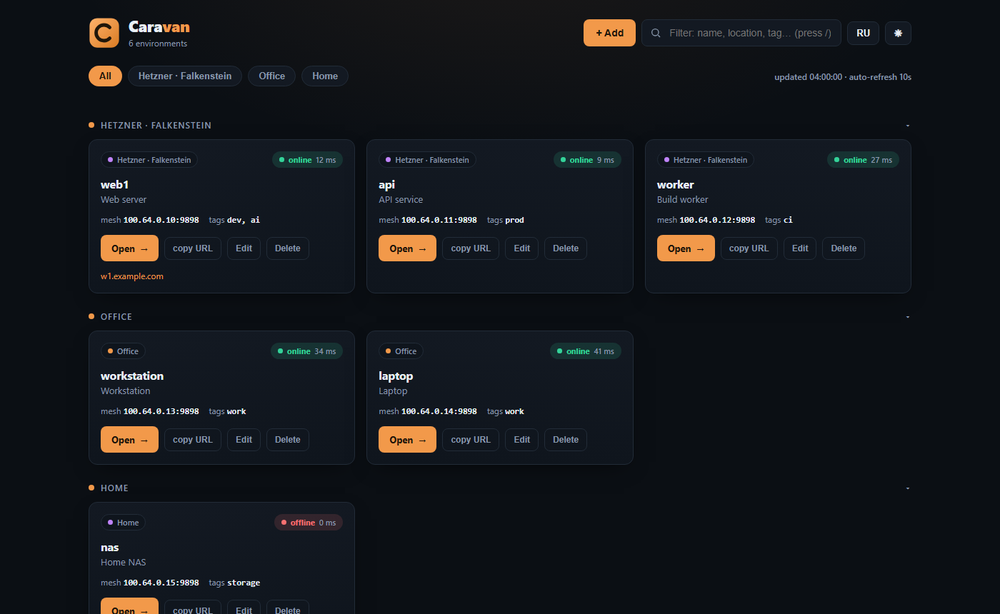
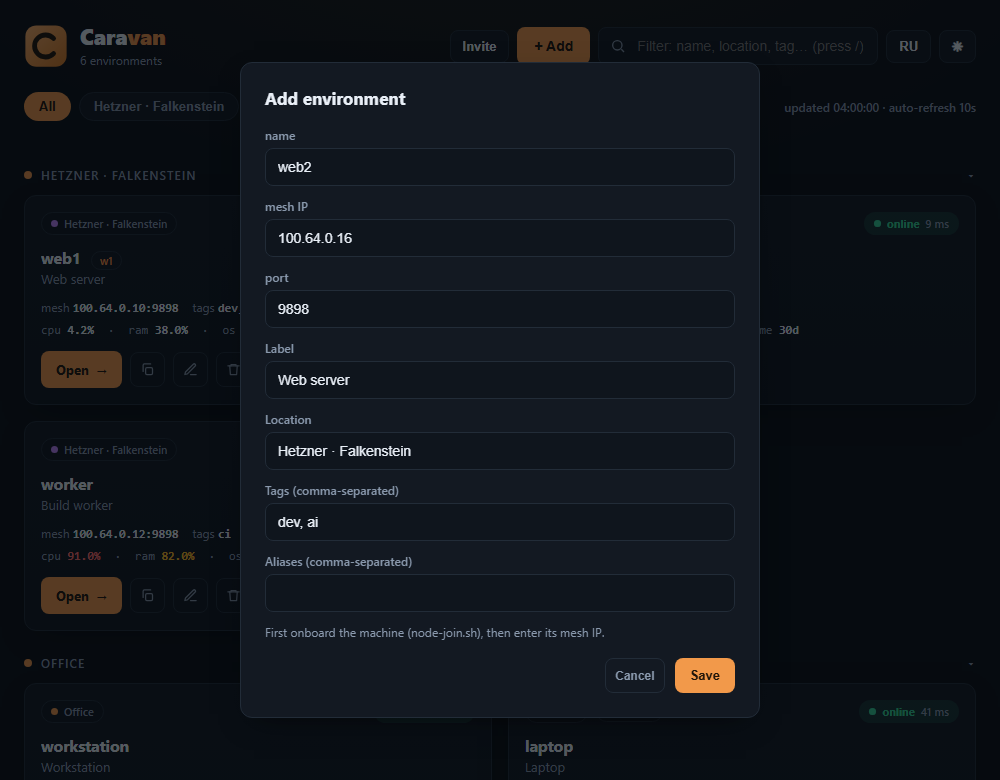

# Caravan

**Your AI coding cockpit — on your own servers, from anywhere.**

[Website](https://leodev-2022.github.io/caravan/) · [Docs](docs/) · [Security](SECURITY.md) · MIT

> ⚠️ **Early-stage software — use at your own risk.** Caravan is pre-1.0.
> **Test it on a fresh, throwaway machine** (a VM, an LXC container, or a spare
> VPS) — **not** on a server with critical data or production workloads. Back up
> anything important first. The installer changes the system (installs Docker,
> uses ports 80/443, runs containers). Provided "as is", without warranty (MIT).

Caravan turns a cheap VPS into a private dashboard for your AI coding agents
([OpenCode](https://opencode.ai) / [CodeNomad](https://github.com/NeuralNomadsAI/CodeNomad))
running across **all** your machines. One command to install, SSO + TOTP at the
door, and a self-hosted mesh so your machines never need inbound ports.

> OpenCode gives you the engine. Caravan gives you the cockpit across all your machines.

## Why Caravan
- **Multi-machine by default** — one window to every dev box: home, work, VPS.
- **Private & cheap** — runs on a ~$3 VPS (1 vCPU / 1–2 GB). Your code never
  leaves your infrastructure.
- **Secure by default** — default-deny firewall, SSO + TOTP, mesh-only nodes,
  root-only secrets. Hardening is built in, not a checklist you must pass.
- **One command, idempotent** — `install.sh` for the hub, `node-join.sh` for machines.
- **Open source** — MIT.

## Screenshots


*Live dashboard — per-machine status, locations, tags, one-click open, behind SSO
(dark & light themes).*



*Register a machine in seconds — onboard it with `node-join.sh`, then add it here.*

## How it works
```
Browser (anywhere)
   │ https://<env>.<DOMAIN>        (public :443)
   ▼
HUB (a cheap always-on VPS)
   ├─ caddy      TLS/ACME + forward_auth + reverse proxy
   ├─ authelia   SSO + TOTP
   ├─ headscale  self-hosted mesh coordinator (SQLite)
   └─ portal     status dashboard + Telegram alerts
   │  each node dials OUT — no inbound ports on your machines
   ▼
Nodes: CodeNomad on :9898 (mesh-only, HTTP)   [+ optional local STT]
```

## Quick start
### 1. Hub (one command)
```bash
curl -fsSL https://raw.githubusercontent.com/leodev-2022/caravan/main/install.sh | sudo bash
```
No domain needed — it auto-uses `<your-ip>.sslip.io` for HTTPS. With a domain:
`… | sudo bash -s -- --domain example.com`. It prints the dashboard URL and a
one-time admin password.

### 2. A machine (node)
On the hub, get a ready-to-paste invite:
```bash
sudo caravan token --expiry 1h
```
It prints **one command** — paste it on the new machine (no flags to learn):
```bash
curl -fsSL https://raw.githubusercontent.com/leodev-2022/caravan/main/tools/node-join.sh | sudo bash -s -- --hub https://mesh.example.com --token <key>
```

### 3. Register the node
```bash
sudo caravan add-node --name web1 --ip <mesh-ip> --port 9898
```
…or click **+ Add** in the dashboard.

## CLI
```
caravan install [--domain NAME | --sslip | --self-signed]   install the hub
caravan update                                              pull images + re-apply
caravan doctor                                              diagnose the hub
caravan nodes list                                          list mesh nodes
caravan token [--user NAME|ID] [--expiry 1h] [--reusable]   issue a join token
caravan add-node --name N --ip IP [--port 9898] [...]       register a node
caravan remove-node --name N                                unregister a node
caravan backup [--out DIR]      caravan restore --file ARCHIVE
caravan uninstall [--purge]
```

## Requirements
- **Hub:** any Ubuntu/Debian VPS; a public IP for ACME — or use `--sslip` /
  `--self-signed`. Runs comfortably on 1 vCPU / 2 GB.
- **Nodes:** Ubuntu/Debian. No public IP and no inbound ports required.

## Documentation
- [Architecture](docs/architecture.md)
- [Operations](docs/operations.md)
- [Security](docs/security.md)
- [FAQ](docs/faq.md)
- [Contributing](docs/contributing.md)

## Credits & disclaimer
Caravan is an independent project. It **consumes** these excellent MIT-licensed
projects as dependencies and does not fork or redistribute their source:
- **[OpenCode](https://opencode.ai)** (anomalyco) — the AI coding engine.
- **[CodeNomad](https://github.com/NeuralNomadsAI/CodeNomad)** (NeuralNomadsAI) — the cockpit UI.

Not affiliated with, or endorsed by, NeuralNomadsAI or the OpenCode team.
All trademarks belong to their respective owners.

## License
MIT
